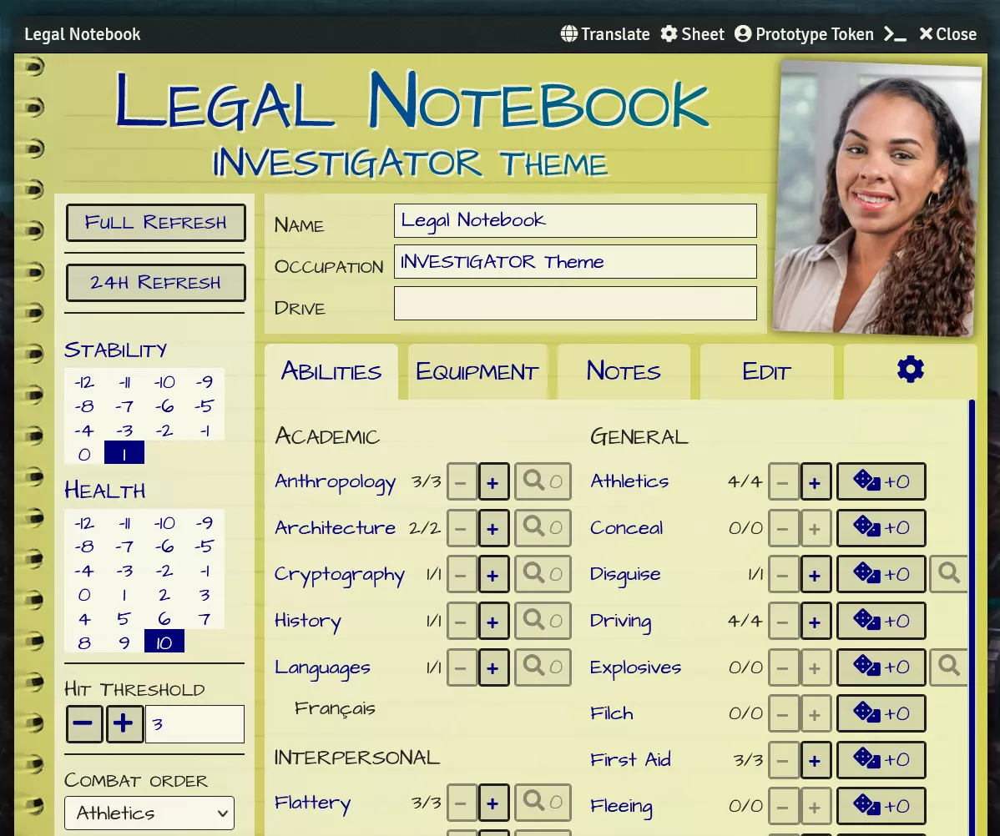

# Legal Notebook theme for INVESTIGATOR for Foundry VTT

A theme for [INVESTIGATOR][investigator], a [GUMSHOE SRD][gumshoe] compatible system for [Foundry VTT][fvtt].

Although this is a fully usable theme, the main intent here is to be an example of how to create a new theme in TypeScript. Themes for INVESTIGATOR are defined in code, but if you know CSS you'll see how it works.

## Adding INVESTIGATOR themes in a module

**One day (hopefully not too long) we will have a way for users to just chuck some JSON into their data folder and have it be interpreted as a theme.** For now what we have is an API, which can be addressed by module authors to create new themes.

## Credits

Photo by <a href="https://unsplash.com/@nordwood?utm_source=unsplash&utm_medium=referral&utm_content=creditCopyText">NordWood Themes</a> on <a href="https://unsplash.com/s/photos/white-texture?utm_source=unsplash&utm_medium=referral&utm_content=creditCopyText">Unsplash</a>

Photo by <a href="https://unsplash.com/@84media?utm_source=unsplash&utm_medium=referral&utm_content=creditCopyText">Brian Tromp</a> on <a href="https://unsplash.com/?utm_source=unsplash&utm_medium=referral&utm_content=creditCopyText">Unsplash</a>
  
[investigator]: https://gitlab.com/n3dst4/investigator-fvtt
[fvtt]: https://foundryvtt.com/
[gumshoe]: https://pelgranepress.com/gumshoe/files/GUMSHOE_SRD_CC_3.pdf